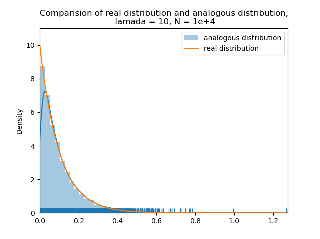
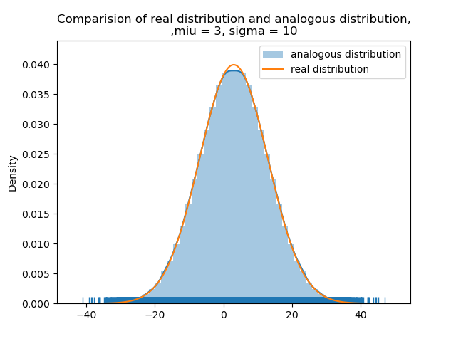
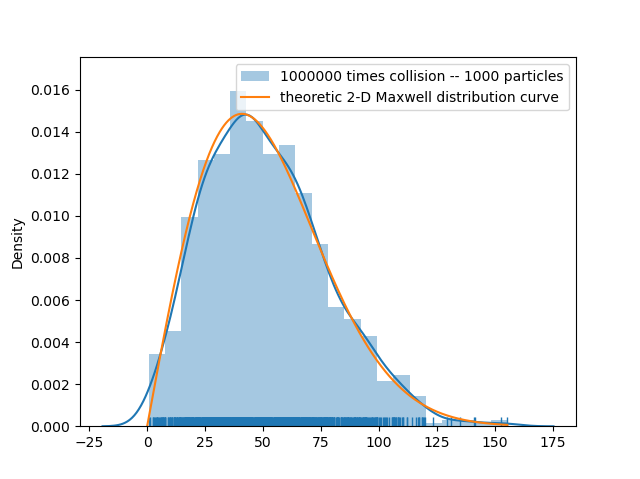
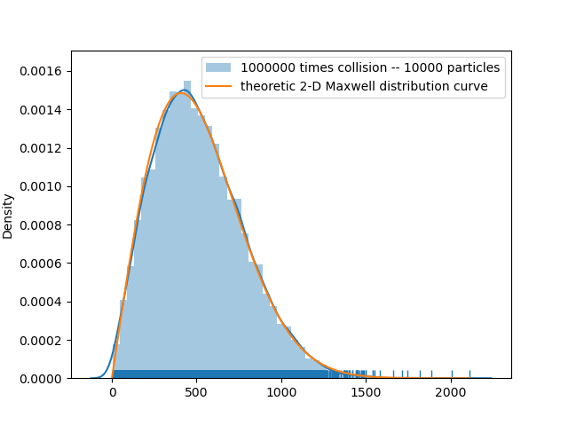
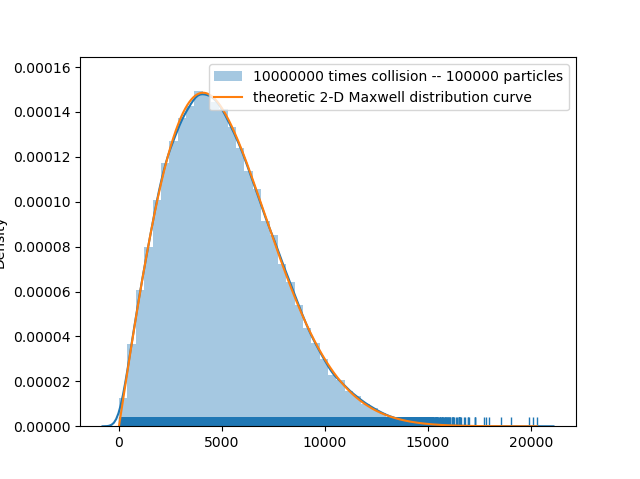

# Computational Physics
These sub-folders are about programming assignments of the course Computational Physics at USTC.

See each folder to see details of source code and reports.

**Textbook**: [马文淦, 《计算物理学》, 科学出版社](https://book.douban.com/subject/1655215/)

**Requirements**

Homework 1~4 are written in Python. Library dependencies are listed in `requirements.txt`. You can install them by `pip install -r requirements.txt`. . 

Homework 5 is written in Mathematica. You need to install [Mathematica](https://www.wolfram.com/mathematica/) to run it.


## Homework 1

It is to estimate $\pi$ by Buffon's needle method (Monte Carlo simulation).

Run `python hw01/pi.py`, results are like this:

```
M = 49875 	N = 78479
the estimation of PI: 3.1470275689223057
Relative error to exact value: 0.0017299872809106288
```

## Homework 2

Assignments are problem-5 and problem-11 in Chapter 2 of the textbook.

Run `python hw02/main.py`, results are like this:

| Result for Problem 5     | Result for Problem 11     |
| ------------------------ | ------------------------- |
|  |  |


## Homework 3

Generate Maxwell distribution by simulating molecule collision.

Run `python hw03/main.py`, results are like this:

| 1000 molecules; 1000,000 collisions | 10,000 molecules; 1000,000 collisions | 100,000 molecules; 10,000,000 collisions |
| ----------------------------------- | ------------------------------------- | ---------------------------------------- |
|              |                |                   |


## Homework 4

Simulating molecules diffusion from a box to a vacuum box.

See [hw4 description](./hw04/hw4.pdf) and [hw4 report](./hw04/result.pdf).

## Homework 5

This homework is to write a Mathematica package and test its usage, to tackle a category of quantum mechanics energy spectrum calculation problem.

See problem-4 in Chapter 8 of the textbook for detailed description.

The package [hw_05.wl](./hw05/hw_05.wl) exposes interfaces as follows:

```mathematica
BeginPackage["ConstantPotential`"]
Clear[WaveOdd,WaveEven,EnergyOdd,EnergyEven,EnergySpectrum]
WaveOdd::usage="求解不同宽度和高度势阱的波函数,奇宇称"
WaveEven::usage="求解不同宽度和高度势阱的波函数,偶宇称"
EnergySpectrum::usage="求解能量谱"
EnergyOdd::usage="奇宇称的能量谱"
EnergyEven::usage="偶宇称的能量谱"
```

See [hw5 report](./hw05/result.pdf) or [result.nb](./hw_05/result.nb) for result demonstration.
